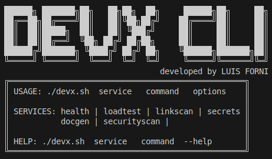

# DevX CLI – Modular Console Toolkit

**DevX CLI** es una herramienta modular en consola que reúne distintos servicios útiles para desarrolladores y equipos técnicos.  
Cada servicio se implementa como un módulo independiente con su propia lógica y subcomando, lo que permite **reutilizar la lógica en otros proyectos** y mantener el código altamente escalable.

---

## Servicios incluidos

## 1️⃣ `health` – Inspector de salud de proyectos
Analiza la estructura de un proyecto y detecta:
- Tamaño total y archivos grandes.
- Variables de entorno usadas y no definidas.
- Dependencias desactualizadas.

**Cómo usar**
```bash
./devx.sh health run [ruta] [--large-mb 25]
```

**Linux / macOS**
```bash
# Ruta relativa (proyecto actual)
./devx.sh health run .

# Ruta absoluta
./devx.sh health run /home/usuario/proyectos/mi_app
```

**Windows (PowerShell)**
```bash
# Ruta relativa
bash devx.sh health run .

# Ruta absoluta
bash devx.sh health run C:\Users\Luis\Documents\Proyectos\mi_app
```

---

## 2️⃣ `loadtest` – Simulador de carga para APIs
Permite probar la resistencia y latencia de un endpoint:
- Define **rps** (requests per second) y duración.
- Soporta headers, payload y métodos HTTP.
- Muestra métricas como latencia media, P95 y máxima.

**Cómo usar**
```bash
./devx.sh loadtest run <url> \
  [--rps 10] [--duration 10] [--method GET] \
  [--timeout 10.0] [--data '<json|texto>'] \
  [--headers '<json>'] [--verify-ssl/--no-verify-ssl]
```

**Linux / macOS**
```bash
./devx.sh loadtest run https://api.midominio.com/endpoint \
  --rps 15 --duration 8 \
  --headers '{"Authorization":"Bearer TOKEN123"}'
```

**Windows (PowerShell)**
```bash
bash devx.sh loadtest run https://api.midominio.com/endpoint `
  --rps 15 --duration 8 `
  --headers '{"Authorization":"Bearer TOKEN123"}'
```

---

## 3️⃣ `linkscan` – Escáner de enlaces rotos
Rastrea una web buscando enlaces internos rotos:
- Respeta el dominio de inicio.
- Muestra links con errores HTTP o inaccesibles.
- Ideal para mantenimiento SEO.

**Cómo usar**
```bash
./devx.sh linkscan run <url> [--limit 100] [--timeout 10.0]
```

**Linux / macOS**
```bash
./devx.sh linkscan run https://example.com --limit 50
```

**Windows (PowerShell)**
```bash
bash devx.sh linkscan run https://example.com --limit 50
```

---

## 4️⃣ `secrets` – Detector de secretos en código
Busca credenciales y tokens filtrados en repositorios:
- Patrones para AWS, JWT, API keys, contraseñas, etc.
- Ignora binarios e imágenes.
- Útil como **pre-commit hook**.

**Cómo usar**
```bash
./devx.sh secrets run [ruta] [--ignore '<regex>']
```

**Linux / macOS**
```bash
./devx.sh secrets run /home/usuario/proyectos/mi_app
```

**Windows (PowerShell)**
```bash
bash devx.sh secrets run . --ignore "\.(png|jpg|jpeg|gif|pdf|zip|gz|tar|ico|lock|bin|pem|p12)$"
```

---

## 5️⃣ `docgen` – Generador de documentación Markdown
Crea documentación automática a partir del código:
- Extrae docstrings de módulos, clases y funciones.
- Genera un `.md` listo para subir a repositorios.
- Compatible con cualquier proyecto Python.

**Cómo usar**
```bash
./devx.sh docgen run [ruta] [--out DOCS.md]
```

**Linux / macOS**
```bash
./devx.sh docgen run /home/usuario/proyectos/mi_app --out /home/usuario/docs/MI_DOC.md
```

**Windows (PowerShell)**
```bash
bash devx.sh docgen run C:\Users\Luis\Documents\Proyectos\mi_app --out C:\Users\Luis\Documents\docs\MI_DOC.md
```

---

## 6️⃣ `securityscan` – Escáner básico de seguridad web
- Analiza un sitio web y detecta configuraciones inseguras o faltantes:
- Headers de seguridad ausentes o débiles (CSP, X-Frame-Options, HSTS, etc.).
- Flags de cookies (`HttpOnly`, `Secure`, `SameSite`).
- Fingerprinting y posibles fugas de información.
- Estado del TLS y fecha de expiración del certificado.
- Puertos web abiertos.
- Opcionalmente, analiza `<meta http-equiv>` en el HTML.

**Cómo usar**
```bash
./devx.sh securityscan run <url> [opciones]
```

**Linux / macOS**
```bash
./devx.sh securityscan run https://www.ejemplo.com
```

**Windows (PowerShell)**
```bash
bash devx.sh securityscan run https://www.ejemplo.com
```

**Ejemplo con salida JSON en directorio específico**
```bash
./devx.sh securityscan run https://www.ejemplo.com --json resultado.json --out-dir ./reports
```

**Ejemplo rápido (sin escaneo de puertos ni TLS)**
```bash
./devx.sh securityscan run https://www.ejemplo.com --quick
```

**Opciones principales**
- `--json <archivo>` → Guarda el resultado en formato JSON.
- `--out-dir <ruta>` → Define el directorio donde guardar el reporte (se crea si no existe).
- `--quick` → Salta el escaneo de puertos y chequeo TLS (más rápido).
- `--fetch-html` → Descarga HTML para analizar `<meta http-equiv>`.
- `--no-verify` → No verifica certificados TLS (solo pruebas).
- `--force-http1` → Fuerza HTTP/1.1 (desactiva HTTP/2).

---

## 7️⃣ `sbom` – Generador de SBOM (CycloneDX)
Genera un **SBOM (Software Bill of Materials)** en formato **CycloneDX JSON** a partir del fichero `requirements.txt`.  
Además consulta la API de [osv.dev](https://osv.dev) para detectar posibles vulnerabilidades de seguridad en las dependencias.

**Ejemplo de salida JSON**
```bash
{
  "bomFormat": "CycloneDX",
  "specVersion": "1.5",
  "components": [
    {
      "type": "library",
      "name": "torch",
      "version": "2.7.1",
      "purl": "pkg:pypi/torch@2.7.1"
    }
  ],
  "_security": {
    "source": "osv.dev",
    "vulnerabilities_by_package": {
      "torch": [
        {
          "id": "GHSA-887c-mr87-cxwp",
          "title": null,
          "summary": null,
          "severity": null
        }
      ]
    }
  }
}
```

**Cómo usar**
```bash
./devx.sh sbom run <ruta_a_requirements.txt|pyproject.toml> [opciones]
```

**Linux / macOS**
```bash
./devx.sh sbom run /home/user/Documents/project/requirements.txt --resolve-installed --osv --osv-details --out sbom_osv.json
```

**Windows (PowerShell)**
```bash
bash devx.sh sbom run /home/user/Documents/project/requirements.txt --resolve-installed --osv --osv-details --out sbom_osv.json
```
---

## 8️⃣ `lint` – Linter + Formateador

Ejecuta Ruff (detector de errores y malas prácticas) y Black (formateador automático).
Permite revisar el código de un proyecto o corregirlo automáticamente con `--fix`.
Si se habilita integración con Git, puede crear una rama de parche (`_fix/lint-YYYYMMDD-HHMMSS`) y hacer commit de los cambios.

**Cómo usar**
```bash
./devx.sh lint run <ruta_al_proyecto> [opciones]
```

**Linux / macOS**
```bash
./devx.sh lint run /home/user/Documents/project
./devx.sh lint run /home/user/Documents/project --fix
```

**Windows (PowerShell)**
```bash
bash devx.sh lint run C:/Users/user/Documents/project
bash devx.sh lint run C:/Users/user/Documents/project --fix
```

---

## 9️⃣ `depgraph` – Analizador de dependencias e imports

Genera un grafo de dependencias de tu proyecto Python:
- Analiza todos los import en el código fuente.
- Diferencia entre dependencias internas (módulos del proyecto) y externas (librerías instaladas).
- Detecta ciclos de importación peligrosos.
- Exporta resultados en DOT, PNG/SVG (requiere Graphviz) o JSON.

**Cómo usar**
```bash
./devx.sh depgraph run [ruta] [opciones]
```

**Linux / macOS**
```bash
# Grafo solo con dependencias internas en JSON
./devx.sh depgraph run . --out deps.json --include-externals false

# Grafo visual en PNG (requiere graphviz)
./devx.sh depgraph run . --out deps.png
```

**Windows (PowerShell)**
```bash
# Grafo solo con dependencias internas
bash devx.sh depgraph run . --out deps.json --include-externals false

# Grafo visual en PNG
bash devx.sh depgraph run . --out deps.png
```

**Ejemplo de salida JSON**
```bash
{
  "nodes": ["devx.cli", "devx.services.depgraph.cli", "devx.services.depgraph.analyzer"],
  "edges": [
    {"src": "devx.cli", "dst": "devx.services.depgraph.cli", "external": false},
    {"src": "devx.services.depgraph.cli", "dst": "typer", "external": true}
  ],
  "cycles": []
}
```

**Opciones principales**
- `--out <archivo>` → Archivo de salida (`.json`, `.dot`, `.png`, `.svg`).
- `--include-externals [true|false]` → Incluye o excluye librerías externas.
- `--rankdir [TB|LR]` → Orientación del grafo (Top-Bottom o Left-Right).
- `--ignore '<regex>'` → Excluir directorios adicionales (ej. `tests`, `build`).

```bash
./devx.sh depgraph run . --out deps.json --ignore build --ignore dist
./devx.sh depgraph run . --out deps.png --rankdir TB
./devx.sh depgraph run . --out deps.json --no-include-externals
```

---

## 1️⃣​0️⃣​ `perf` – Perfilador de rendimiento

Perfila un script Python y muestra las funciones más costosas.

- **Por defecto:** usa `cProfile` y enseña un Top N (cumulative o time).
- **Opcional:** `--pyinstrument` para un reporte más visual.
- Puede guardar el reporte en `reports/perf/` si pasas `--out`.

**Uso básico**
```bash
./devx.sh perf run script.py
```

---

## 1️⃣​1️⃣​ `coverage` – Reporte de cobertura de tests

Ejecuta pytest con plugin `pytest-cov` y genera un informe de cobertura de código.
Muestra una tabla resumida en consola y guarda los resultados en JSON dentro de `reports/coverage/`.

**⚙️ Opciones principales**
- `--cov <módulo>` → Ruta(s) a medir cobertura (repetible).
- `--out-dir <dir>` → Carpeta donde guardar `coverage.json`.
- `--min-total <n>` → Falla si el total de cobertura es menor al umbral.
- `--top <n>` → Mostrar solo los N archivos con menor cobertura.
- `--workdir <dir>` → Directorio de trabajo donde correr pytest.
- `--show-external` → Mostrar también archivos externos al proyecto (por defecto se ocultan).

**Uso básico**
```bash
./devx.sh coverage run --cov devx --min-total 60
```

**Ejemplo de salida**
```bash
🧪 Coverage
Tests: tests
Targets: devx

Cobertura por archivo
┏━━━━━━━━━━━━━━━━━━━━━━━━━━━━┳━━━━━━━┳━━━━━━━┳━━━━━━━━━┓
┃ File                       ┃ Stmts ┃ Miss  ┃ Cover % ┃
┡━━━━━━━━━━━━━━━━━━━━━━━━━━━━╇━━━━━━━╇━━━━━━━╇━━━━━━━━━┩
│ devx/core/utils.py         │    30 │     2 │   93.3  │
│ devx/services/coverage/... │    54 │     5 │   90.7  │
└────────────────────────────┴───────┴───────┴─────────┘

📊 Total: 91.2%
💾 JSON: reports/coverage/coverage.json
```

## 1️⃣2️⃣ `dockercheck` – Auditoría de imágenes Docker

Audita **Dockerfile** e imágenes Docker para detectar malas prácticas y optimizar el tamaño final.

### 🔎 Qué hace
- Revisa **Dockerfile**:
  - Uso (o falta) de **multi-stage builds**.
  - Instrucciones que usan **root** en lugar de un usuario dedicado.
  - Capas redundantes o comandos `RUN` mal optimizados.
  - Orden recomendado de instrucciones (`COPY` antes de `RUN`, etc.).
- Chequea **imagen construida**:
  - Tamaño total de la imagen.
  - Lista las capas más pesadas (`docker history`).
- Genera reporte en tabla **Rich** con sugerencias, severidad e informe opcional en JSON.

**Uso básico**
```bash
./devx.sh dockercheck run /home/user/Documents/project/Dockerfile
```

**Opciones:**
```bash
--image myapp:latest    Nombre/etiqueta de la imagen a construir
--max-size 500MB        Falla si la imagen supera el tamaño indicado
--json-out              Guarda el reporte en JSON
```

---

## ℹ️ Ayuda general

```bash
./devx.sh
./devx.sh <service> --help
./devx.sh <service> <command> --help

./devx.sh perf run /home/user/Documents/script.py --args "foo bar" --limit 15 --sort cumulative --out perf.json
./devx.sh perf run /home/user/Documents/script.py  --pyinstrument --out perf.txt
```

---

## Cómo ejecutar

```bash
# Ayuda general
./devx.sh
./devx.sh <service> --help
./devx.sh <service> <command> --help

# Ejemplos rápidos de cada servicio
./devx.sh health run .
./devx.sh loadtest run https://httpbin.org/get --rps 20 --duration 5
./devx.sh linkscan run https://example.com --limit 50
./devx.sh secrets run .
./devx.sh docgen run . --out DOCS.md
./devx.sh securityscan run https://www.ejemplo.com --quick
./devx.sh sbom run requirements.txt --osv --out reports/sbom/sbom.json
./devx.sh lint run /home/user/Documents/project --fix
./devx.sh depgraph run . --out deps.json
./devx.sh perf run /home/user/Documents/script.py
./devx.sh coverage run --cov devx --min-total 80
./devx.sh dockercheck run /home/user/Documents/project/Dockerfile
```
---

## Cómo ejecutar los tests

```bash
pytest -q
```

---

## Estructura del proyecto

```bash
devx_cli/
├── .gitignore
├── README.md
├── assets
│   └── devx_cli.png
├── devx
│   ├── __init__.py
│   ├── __main__.py
│   ├── cli.py
│   ├── core
│   │   ├── __init__.py
│   │   ├── config.py
│   │   ├── http.py
│   │   ├── logging.py
│   │   └── utils.py
│   └── services
│       ├── coverage
│       │   ├── __init__.py
│       │   ├── cli.py
│       │   └── runner.py
│       ├── depgraph
│       │   ├── __init__.py
│       │   ├── analyzer.py
│       │   └── cli.py
│       ├── docgen
│       │   ├── __init__.py
│       │   ├── cli.py
│       │   └── generator.py
│       ├── dockercheck
│       │   ├── __init__.py
│       │   ├── analyzer.py
│       │   ├── cli.py
│       │   └── runner.py
│       ├── health
│       │   ├── __init__.py
│       │   ├── cli.py
│       │   └── scanner.py
│       ├── linkscan
│       │   ├── __init__.py
│       │   ├── cli.py
│       │   └── crawler.py
│       ├── lint
│       │   ├── __init__.py
│       │   ├── cli.py
│       │   ├── git_utils.py
│       │   └── runner.py
│       ├── loadtest
│       │   ├── __init__.py
│       │   ├── cli.py
│       │   └── engine.py
│       ├── perf
│       │   ├── __init__.py
│       │   ├── cli.py
│       │   └── profiler.py
│       ├── sbom
│       │   ├── __init__.py
│       │   └── cli.py
│       ├── secrets
│       │   ├── __init__.py
│       │   ├── cli.py
│       │   └── rules.py
│       └── securityscan
│           ├── __init__.py
│           ├── analyzer.py
│           └── cli.py
├── devx.sh
├── pyproject.toml
├── reports
│   ├── coverage
│   ├── depgraph
│   ├── dockercheck
│   ├── perf
│   ├── sbom
│   └── securityscan
├── requirements.txt
├── scripts
│   ├── logo_ascii.txt
│   └── post_run_help.txt
└── tests
    ├── conftest.py
    ├── test_coverage.py
    ├── test_depgraph.py
    ├── test_docgen.py
    ├── test_dockercheck.py
    ├── test_health.py
    ├── test_linkscan.py
    ├── test_lint.py
    ├── test_loadtest.py
    ├── test_perf.py
    ├── test_sbom.py
    ├── test_secrets.py
    └── test_securityscan.py
```

---

## Notas finales
- Cross-platform: Funciona en Linux, macOS y Windows (Git Bash).
- Extensible: Fácil de añadir nuevos módulos de servicio.
- Reutilizable: La lógica de cada servicio puede usarse fuera del CLI.

