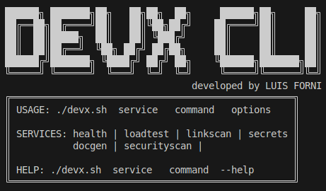

# DevX CLI – Modular Console Toolkit

**DevX CLI** es una herramienta modular en consola que reúne distintos servicios útiles para desarrolladores y equipos técnicos.  
Cada servicio se implementa como un módulo independiente con su propia lógica y subcomando, lo que permite **reutilizar la lógica en otros proyectos** y mantener el código altamente escalable.

---

## Servicios incluidos

### 1️⃣ `health` – Inspector de salud de proyectos
Analiza la estructura de un proyecto y detecta:
- Tamaño total y archivos grandes.
- Variables de entorno usadas y no definidas.
- Dependencias desactualizadas.

**Cómo usar**
```bash
./devx.sh health run [ruta] [--large-mb 25]
```

**Linux / macOS**
```bash
# Ruta relativa (proyecto actual)
./devx.sh health run .

# Ruta absoluta
./devx.sh health run /home/usuario/proyectos/mi_app
```

**Windows (PowerShell)**
```bash
# Ruta relativa
bash devx.sh health run .

# Ruta absoluta
bash devx.sh health run C:\Users\Luis\Documents\Proyectos\mi_app
```

---

### 2️⃣ `loadtest` – Simulador de carga para APIs
Permite probar la resistencia y latencia de un endpoint:
- Define **rps** (requests per second) y duración.
- Soporta headers, payload y métodos HTTP.
- Muestra métricas como latencia media, P95 y máxima.

**Cómo usar**
```bash
./devx.sh loadtest run <url> \
  [--rps 10] [--duration 10] [--method GET] \
  [--timeout 10.0] [--data '<json|texto>'] \
  [--headers '<json>'] [--verify-ssl/--no-verify-ssl]
```

**Linux / macOS**
```bash
./devx.sh loadtest run https://api.midominio.com/endpoint \
  --rps 15 --duration 8 \
  --headers '{"Authorization":"Bearer TOKEN123"}'
```

**Windows (PowerShell)**
```bash
bash devx.sh loadtest run https://api.midominio.com/endpoint `
  --rps 15 --duration 8 `
  --headers '{"Authorization":"Bearer TOKEN123"}'
```

---

### 3️⃣ `linkscan` – Escáner de enlaces rotos
Rastrea una web buscando enlaces internos rotos:
- Respeta el dominio de inicio.
- Muestra links con errores HTTP o inaccesibles.
- Ideal para mantenimiento SEO.

**Cómo usar**
```bash
./devx.sh linkscan run <url> [--limit 100] [--timeout 10.0]
```

**Linux / macOS**
```bash
./devx.sh linkscan run https://example.com --limit 50
```

**Windows (PowerShell)**
```bash
bash devx.sh linkscan run https://example.com --limit 50
```

---

### 4️⃣ `secrets` – Detector de secretos en código
Busca credenciales y tokens filtrados en repositorios:
- Patrones para AWS, JWT, API keys, contraseñas, etc.
- Ignora binarios e imágenes.
- Útil como **pre-commit hook**.

**Cómo usar**
```bash
./devx.sh secrets run [ruta] [--ignore '<regex>']
```

**Linux / macOS**
```bash
./devx.sh secrets run /home/usuario/proyectos/mi_app
```

**Windows (PowerShell)**
```bash
bash devx.sh secrets run . --ignore "\.(png|jpg|jpeg|gif|pdf|zip|gz|tar|ico|lock|bin|pem|p12)$"
```

---

### 5️⃣ `docgen` – Generador de documentación Markdown
Crea documentación automática a partir del código:
- Extrae docstrings de módulos, clases y funciones.
- Genera un `.md` listo para subir a repositorios.
- Compatible con cualquier proyecto Python.

**Cómo usar**
```bash
./devx.sh docgen run [ruta] [--out DOCS.md]
```

**Linux / macOS**
```bash
./devx.sh docgen run /home/usuario/proyectos/mi_app --out /home/usuario/docs/MI_DOC.md
```

**Windows (PowerShell)**
```bash
bash devx.sh docgen run C:\Users\Luis\Documents\Proyectos\mi_app --out C:\Users\Luis\Documents\docs\MI_DOC.md
```

---

### 6️⃣ `securityscan` – Escáner básico de seguridad web
- Analiza un sitio web y detecta configuraciones inseguras o faltantes:
- Headers de seguridad ausentes o débiles (CSP, X-Frame-Options, HSTS, etc.).
- Flags de cookies (`HttpOnly`, `Secure`, `SameSite`).
- Fingerprinting y posibles fugas de información.
- Estado del TLS y fecha de expiración del certificado.
- Puertos web abiertos.
- Opcionalmente, analiza `<meta http-equiv>` en el HTML.

**Cómo usar**
```bash
./devx.sh securityscan run <url> [opciones]
```

**Linux / macOS**
```bash
./devx.sh securityscan run https://www.ejemplo.com
```

**Windows (PowerShell)**
```bash
bash devx.sh securityscan run https://www.ejemplo.com
```

**Ejemplo con salida JSON en directorio específico**
```bash
./devx.sh securityscan run https://www.ejemplo.com --json resultado.json --out-dir ./reports
```

**Ejemplo rápido (sin escaneo de puertos ni TLS)**
```bash
./devx.sh securityscan run https://www.ejemplo.com --quick
```

**Opciones principales**
- `--json <archivo>` → Guarda el resultado en formato JSON.
- `--out-dir <ruta>` → Define el directorio donde guardar el reporte (se crea si no existe).
- `--quick` → Salta el escaneo de puertos y chequeo TLS (más rápido).
- `--fetch-html` → Descarga HTML para analizar `<meta http-equiv>`.
- `--no-verify` → No verifica certificados TLS (solo pruebas).
- `--force-http1` → Fuerza HTTP/1.1 (desactiva HTTP/2).

---

## ℹ️ Ayuda general

```bash
./devx.sh
./devx.sh <service> --help
./devx.sh <service> <command> --help
```

---

## Cómo ejecutar

```bash
chmod +x devx.sh
./devx.sh
./devx.sh health run .
./devx.sh loadtest run https://httpbin.org/get --rps 20 --duration 5
./devx.sh linkscan run https://example.com --limit 50
./devx.sh secrets run .
./devx.sh docgen run . --out DOCS.md
```
---

## Cómo ejecutar los tests

```bash
python -m pytest -q
```

---

## Estructura del proyecto

```bash
devx_cli/
├─ devx.sh
├─ pyproject.toml
├─ requirements.txt
├─ README.md
├─ scripts/
│  ├─ logo_ascii.txt
│  └─ post_run_help.txt
├─ devx/
│  ├─ __init__.py
│  ├─ __main__.py
│  ├─ cli.py
│  ├─ core/
│  │  ├─ __init__.py
│  │  ├─ config.py
│  │  ├─ logging.py
│  │  ├─ http.py
│  │  └─ utils.py
│  └─ services/
│     ├─ health/
│     │  ├─ __init__.py
│     │  ├─ cli.py
│     │  └─ scanner.py
│     ├─ loadtest/
│     │  ├─ __init__.py
│     │  ├─ cli.py
│     │  └─ engine.py
│     ├─ linkscan/
│     │  ├─ __init__.py
│     │  ├─ cli.py
│     │  └─ crawler.py
│     ├─ secrets/
│     │  ├─ __init__.py
│     │  ├─ cli.py
│     │  └─ rules.py
│     ├─ docgen/
│     │  ├─ __init__.py
│     │  ├─ cli.py
│     │  └─ generator.py
│     └─ securityscan/
│        ├─ __init__.py
│        ├─ cli.py
│        └─ analyzer.py
└─ tests/
   ├─ conftest.py
   ├─ test_health.py
   ├─ test_loadtest.py
   ├─ test_linkscan.py
   ├─ test_secrets.py
   ├─ test_docgen.py
   └─ test_securityscan.py
```

---

## Notas finales
- Cross-platform: Funciona en Linux, macOS y Windows (Git Bash).
- Extensible: Fácil de añadir nuevos módulos de servicio.
- Reutilizable: La lógica de cada servicio puede usarse fuera del CLI.

